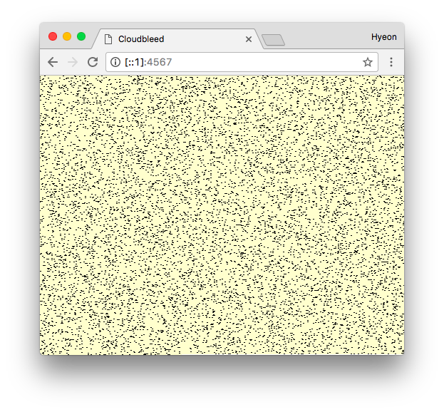

Tiny little Cloudbleed impact viewer
========
```bash
# Requires Ruby 2.0+
bundle install
bundle exec run
```



> A screenshot with dummy data

```bash
# Create dummy data for test purpose
ruby -e 'puts (0...100000).map { (["asdf.com"]*9+["hyeon.me"]).sample } .join("\n")' > sorted_unique_cf.txt
```
